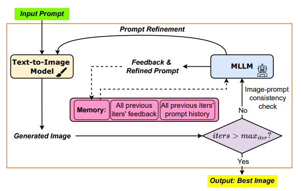
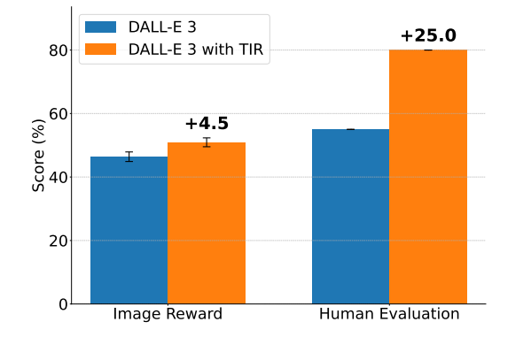

# Test-time Prompt Refinement for Text-to-Image Models

[Paper](https://arxiv.org/abs/2507.22076) | [ICCV 2025 Presentation](https://openaccess.thecvf.com/content/ICCV2025W/MARS2/papers/Khan_Test-time_Prompt_Refinement_for_Text-to-Image_Models_ICCVW_2025_paper.pdf)

Official implementation of *Test-time Prompt Refinement for Text-to-Image Models* [1], accepted to the ICCV 2025 Workshop on Multimodal Reasoning and Slow Thinking in Large Model Era (MARS2).



## What's in this repo

**T2I generation backbones**
| Backbone | Versions | Entry point |
|---|---|---|
| Stable Diffusion | 1.4, 1.5, 2.1 | `src/run_stable_diffusion_1_2.py` |
| Stable Diffusion XL | - | `src/run_diffusers.py --model sdxl` |
| Stable Diffusion 3 | medium | `src/run_diffusers.py --model sd3` |
| SANA | 1.5 | `src/run_diffusers.py --model sana1.5` |
| DALL-E | 3 | `src/run_dalle.py` |

SD 1.4/1.5/2.1 additionally supports resuming from a partial (intermediate) latent instead of always restarting from noise each round; the other backbones always do a full restart. SDXL, SD3, and SANA 1.5 support was added after the paper's publication.

**MLLM judge/refiner**, selected per run with `--mllm`:
- `qwen`, Qwen2.5-VL-7B-Instruct, run locally (default)
- `gpt4o`, GPT-4o via Azure OpenAI

**Benchmarks**
- [GenEval](https://arxiv.org/abs/2310.11513) [2], 553 prompts across 6 compositional tasks.
- [DrawBench](https://arxiv.org/abs/2205.11487) [3], open-ended prompts from Imagen.
- A custom benchmark built on the negation, counting, attribute-binding, and spatial-relationship prompt categories from LLM-grounded Diffusion [4] (`t2i_benchmark_dataset.json`, 300 prompts). Scoring for this benchmark (OWL-ViT based, `evaluation/`) is implemented in this repo, since no public evaluation code exists for it elsewhere. GenEval and DrawBench scoring themselves are external; this repo prepares images in each benchmark's expected format, and you run their own evaluators separately.

## Repository structure

```
src/
  run_stable_diffusion_1_2.py   # TIR loop for SD 1.4 / 1.5 / 2.1
  run_diffusers.py              # TIR loop for SDXL / SD3 / SANA 1.5
  run_dalle.py                  # TIR loop for DALL-E 3
  qwen_integration.py           # Qwen2.5-VL judge/refiner
  aoai.py                       # GPT-4o judge/refiner (Azure OpenAI)
  qwen_vl_utils.py              # image-loading helpers for Qwen
  diffusion/                    # SD 1.4/1.5/2.1 internals (model loading, denoising loop)

scripts/
  extract/
    extract_prompts.py          # evaluation_metadata.jsonl -> filtered_prompts.json (GenEval)
    build_query_jsons.py        # t2i_benchmark_dataset.json -> per-category query JSONs
  pre_process/
    prepare_drawbench_prompts.py  # pulls DrawBench prompts from HuggingFace
    image_prompt_mapping.py       # prompt_id -> prompt text map for DrawBench
  post_process/
    post_process_geneval.py     # reorganizes output into GenEval's expected folder layout
    post_process_drawbench.py   # flattens output into a folder of prompt_XXX.png images
    image_selection.py          # shared logic: which image is "the" answer per prompt
  geneval/        # config_*.sh + stable_diffusion_1_2.sh / diffusers.sh / dalle.sh
  drawbench/      # same, for DrawBench
  t2i_benchmark/  # same, for the custom benchmark (also runs scoring)

evaluation/
  test_negation.py, test_generative_numeracy.py,
  test_spatial_relationships.py, test_object_detection.py   # scoring for the custom benchmark
  object_detection.py, image_utils.py, visualization.py, image_selection.py, config.py

t2i_benchmark_dataset.json    # the custom benchmark's 300 prompts
evaluation_metadata.jsonl     # GenEval's 553 prompts
```

## Setup

```bash
git clone https://github.com/hafeezkhan909/Test-time-Image-Refinement.git
cd Test-time-Image-Refinement
pip install -r requirements.txt
```

SANA 1.5 needs a `diffusers` build newer than the latest PyPI release:
```bash
pip install git+https://github.com/huggingface/diffusers
```

## Running the pipeline

You can call each script below directly, or use the ready-made `.sh` files in `scripts/{geneval,drawbench,t2i_benchmark}/`. Each one comes as a `config_*.sh` you edit and a runner that does the rest: build the prompts if they don't exist yet, run TIR, then post-process (and for the T2I benchmark, score it too).

### `run_stable_diffusion_1_2.py` (SD 1.4 / 1.5 / 2.1)

| Arg | Default | Meaning |
|---|---|---|
| `--model_version` | `1.5` | `1.4`, `1.5`, or `2.1` |
| `--prompts_file` | `filtered_prompts.json` | Prompts grouped by tag |
| `--output_dir` | `test/test` | Where outputs are written |
| `--restart_steps` | `0 0 0` | One entry per refinement round. `0` means restart from noise, a nonzero value (e.g. `75`) resumes from the latent saved at that step instead, for intermediate generation |
| `--refinement_step` | `99` | Denoising step (of 100) at which the MLLM judges the image |
| `--seed` | `42` | Generator seed |
| `--num_inference_steps` | `100` | Denoising steps |
| `--guidance_scale` | `7.5` | Classifier-free guidance scale |
| `--height` / `--width` | `512` / `512` | Output resolution |
| `--mllm` | `qwen` | `qwen` or `gpt4o` |

```bash
python src/run_stable_diffusion_1_2.py \
  --model_version 1.5 --prompts_file filtered_prompts.json \
  --output_dir new_outputs/batch_results --restart_steps 0 0 0 \
  --refinement_step 99 --mllm qwen
```
Ready-to-run: `scripts/geneval/stable_diffusion_1_2.sh`, `scripts/drawbench/stable_diffusion_1_2.sh`, `scripts/t2i_benchmark/stable_diffusion_1_2.sh`.

### `run_diffusers.py` (SDXL / SD3 / SANA 1.5)

| Arg | Default | Meaning |
|---|---|---|
| `--model` | `sdxl` | `sdxl`, `sd3`, or `sana1.5` |
| `--prompts_file` | `filtered_prompts.json` | Prompts grouped by tag |
| `--output_dir` | `outputs` | Where outputs are written |
| `--refinement_iterations` | `3` | Number of refinement rounds, always a full restart |
| `--num_inference_steps` | `100` | Denoising steps |
| `--guidance_scale` | - | Defaults to `7.5` for sdxl/sd3, `4.5` for sana1.5 |
| `--height` / `--width` | `1024` / `1024` | Output resolution |
| `--mllm` | `qwen` | `qwen` or `gpt4o` |

```bash
python src/run_diffusers.py \
  --model sdxl --prompts_file filtered_prompts.json \
  --output_dir new_outputs/batch_results_diffusers \
  --refinement_iterations 3 --mllm qwen
```
Ready-to-run: `scripts/geneval/diffusers.sh`, `scripts/drawbench/diffusers.sh`, `scripts/t2i_benchmark/diffusers.sh`.

### `run_dalle.py` (DALL-E 3)

Needs Azure OpenAI credentials, set before running:
```bash
export ENDPOINT_URL="https://<your-resource>.openai.azure.com/"
export DALLE_MODEL="dalle3"          # your DALL-E 3 deployment name
export AOAI_JUDGE_MODEL="gpt-4o"     # only needed if --mllm gpt4o
az login
```

| Arg | Default | Meaning |
|---|---|---|
| `--prompts_file` | `filtered_prompts.json` | Prompts grouped by tag |
| `--output_dir` | `dalle_outputs` | Where outputs are written |
| `--refinement_iterations` | `3` | Number of refinement rounds |
| `--size` | `1024x1024` | `1024x1024`, `1792x1024`, or `1024x1792` |
| `--quality` | `standard` | `standard` or `hd` |
| `--mllm` | `qwen` | `qwen` or `gpt4o` |

```bash
python src/run_dalle.py \
  --prompts_file filtered_prompts.json --output_dir new_outputs/batch_results_dalle \
  --refinement_iterations 3 --size 1024x1024 --quality standard --mllm qwen
```
Ready-to-run: `scripts/geneval/dalle.sh`, `scripts/drawbench/dalle.sh`, `scripts/t2i_benchmark/dalle.sh`.

## Prompt template

Both `qwen_integration.py` and `aoai.py` judge and refine prompts using the same template:

```
### Evaluation Task:
You are an **Image Improvement Assistant**. Your job is to help make the image more aligned with the ORIGINAL prompt.

### **Given Inputs:**
1. **Original User Prompt:**
- {original_prompt}

2. **Last Used Prompt:**
- {last_prompt}

3. **Prompt History:**
{history_text}

4. **Current Image Analysis:**
- Look at the image and identify what aspects DIFFER from what the ORIGINAL prompt requested
- Analyze what essential elements from the ORIGINAL prompt are missing or incorrectly represented
- Ignore image quality issues like noise, blurriness, or artifacts

### **Your Task:**
1. Create a NEW PROMPT that will help generate an image that better matches the ORIGINAL prompt
2. Your new prompt should be a modification of the last used prompt
3. Focus on fixing what's missing or incorrectly represented in the current image
4. The goal is to get progressively closer to fulfilling the ORIGINAL prompt

### **Decision Process:**
1. If the image ALREADY closely represents the ORIGINAL prompt:

DECISION: "True"
REFINED PROMPT: "<An enhanced version of the last prompt that maintains alignment>"

2. If the image DOES NOT adequately represent the ORIGINAL prompt:

DECISION: "False"
REFINED PROMPT: "<Your NEW prompt that addresses the specific misalignments>"

Follow this exact output format:
DECISION: "True" or "False"
REFINED PROMPT: "<Your new prompt here>"
```

You can add more in-context examples per category directly into this template. We found the model benefits from having more in-context examples, especially on the harder categories.

## Benchmark results

**LLM-Grounded Diffusion benchmark** [4]:

| Method | Negation | Numeracy | Attribute | Spatial | Average |
|---|---|---|---|---|---|
| SD-1.5 | 35.0 | 40.0 | 42.0 | 38.0 | 38.75 |
| w/ TIR | 80.0 | 51.7 | 30.0 | 54.5 | 54.0 (+15.25) |
| SD-2.1 | 45.0 | 50.6 | 18.0 | 44.5 | 39.5 |
| w/ TIR | 85.0 | 56.0 | 18.0 | 43.0 | 50.5 (+11.0) |
| Flux | 10.0 | 52.2 | 83.0 | 81.5 | 56.7 |
| w/ TIR | 55.0 | 64.7 | 81.8 | 77.0 | 69.6 (+12.9) |
| DALL-E 3 | 31.6 | 44.5 | 73.0 | 81.0 | 57.5 |
| w/ TIR | 73.7 | 49.2 | 71.0 | 83.0 | 69.2 (+11.7) |

**GenEval** [2]:

| Model | Position | Counting | Single Obj. | Two Object | Color Attr | Colors | Overall |
|---|---|---|---|---|---|---|---|
| Flux | 19.00 | 68.75 | 100.00 | 75.76 | 48.00 | 77.66 | 64.86 |
| w/ TIR | 49.00 | 71.25 | 98.75 | 80.81 | 47.00 | 80.85 | 71.27 (+6.41) |
| DALL-E 3 | 34.00 | 48.75 | 96.25 | 77.78 | 31.00 | 74.47 | 60.37 |
| w/ TIR | 45.00 | 60.00 | 96.25 | 82.83 | 38.00 | 86.17 | 68.04 (+7.67) |

**MLLM comparison on GenEval** [2]:

| Model | Position | Counting | Single Obj. | Two Object | Color Attr | Colors | Overall |
|---|---|---|---|---|---|---|---|
| Flux | 19.00 | 68.75 | 100.00 | 75.76 | 48.00 | 77.66 | 64.86 |
| w/ TIR (Qwen2.5-VL-7B) | 29.00 | 67.50 | 98.75 | 86.87 | 44.00 | 81.91 | 68.01 (+3.15) |

**DrawBench:**



## References

[1] Khan, M. A. H., Jain, Y., Bhattacharyya, S., & Vineet, V. (2025). Test-time Prompt Refinement for Text-to-Image Models. *ICCV 2025 Workshops (MARS2)*, 6506-6516.

[2] Ghosh, D., Hajishirzi, H., & Schmidt, L. (2023). GenEval: An Object-Focused Framework for Evaluating Text-to-Image Alignment. *NeurIPS 2023*.

[3] Saharia, C., et al. (2022). Photorealistic Text-to-Image Diffusion Models with Deep Language Understanding. *NeurIPS 2022*.

[4] Lian, L., Li, B., Yala, A., & Darrell, T. (2023). LLM-grounded Diffusion: Enhancing Prompt Understanding of Text-to-Image Diffusion Models with Large Language Models. *arXiv:2305.13655*.

```bibtex
@InProceedings{Khan_2025_ICCV,
    author    = {Khan, Mohammed Abdul Hafeez and Jain, Yash and Bhattacharyya, Siddhartha and Vineet, Vibhav},
    title     = {Test-time Prompt Refinement for Text-to-Image Models},
    booktitle = {Proceedings of the IEEE/CVF International Conference on Computer Vision (ICCV) Workshops},
    month     = {October},
    year      = {2025},
    pages     = {6506-6516}
}
```

## Built on

This work builds on the following models: [Stable Diffusion](https://arxiv.org/abs/2112.10752), [SDXL](https://arxiv.org/abs/2307.01952), [Stable Diffusion 3](https://arxiv.org/abs/2403.03206), [SANA 1.5](https://arxiv.org/abs/2501.18427), [DALL-E 3](https://cdn.openai.com/papers/dall-e-3.pdf), [Qwen2.5-VL](https://arxiv.org/abs/2502.13923), and GPT-4o. Thanks to all their authors for making these models available.